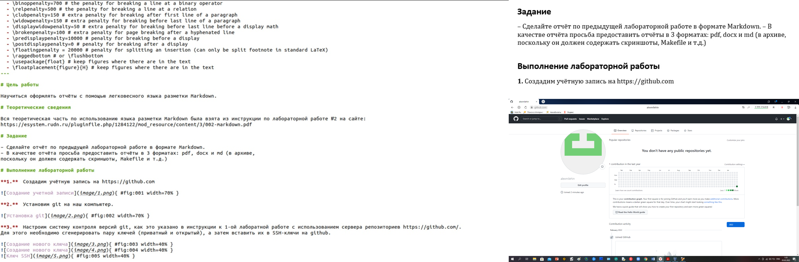
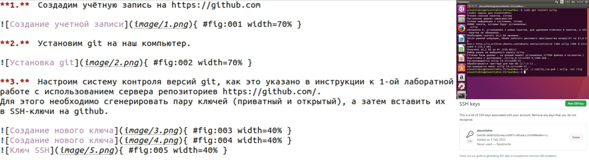
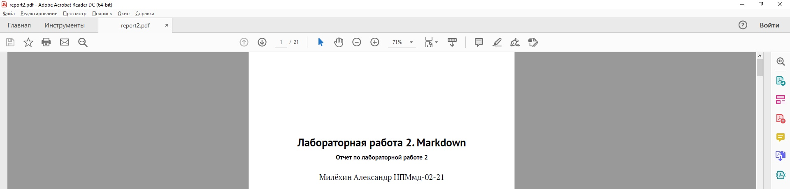
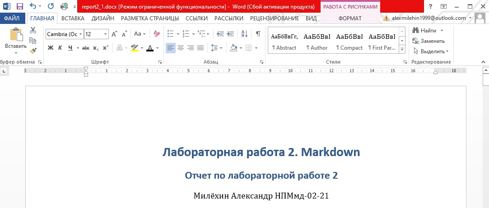

---
## Front matter
lang: ru-RU
title: Markdown
author: Милёхин Александр НПМмд-02-21

## Formatting
mainfont: PT Serif
romanfont: PT Serif
sansfont: PT Sans
monofont: PT Mono
toc: false
slide_level: 2
theme: metropolis
header-includes: 
 - \metroset{progressbar=frametitle,sectionpage=progressbar,numbering=fraction}
 - '\makeatletter'
 - '\beamer@ignorenonframefalse'
 - '\makeatother'
aspectratio: 43
section-titles: true
---

## Работа с Markdown

{ #fig:001 width=70% }

- Так как данная лабораторная работа строится на Лабораторной работе №1, мы копируем основные моменты с прошлого отчёта

## Оформляем ход работы

- Расписываем полностью алгоритм работы с прошлой лабораторной работы.

- Оформление скриншота в Markdown: обязательно указывать полную ссылку для каждого изображения (пример оформления ссылки представлен на скриншоте)

{ #fig:002 width=70% }

## Создание отчета в трёх форматах

Также мы можем дополнительно создать два файла в формате pdf и docx.

{ #fig:005 width=70% }
{ #fig:006 width=70% }

## Выводы

Я научился работать с Markdown, также научился создавать pdf и docx файлы из файла Markdown и сделал отчёт по предыдущей лабораторной работе в формате Markdown.

##

Спасибо за внимание!

